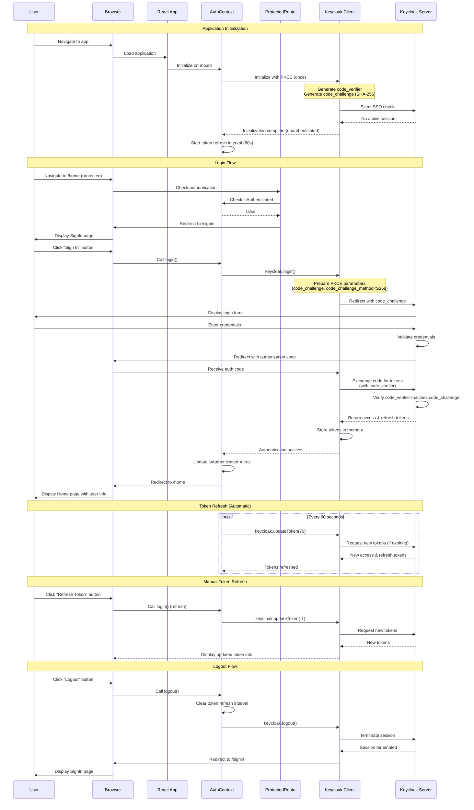

# React + TypeScript + Vite

This is a React application with Keycloak SSO integration implementing OAuth 2.0 Authorization Code Flow with PKCE.

## Features

- ✅ **React 19** with TypeScript
- ✅ **Vite** for fast development and optimized builds
- ✅ **Keycloak SSO Integration** with OAuth 2.0 PKCE flow
- ✅ **React Router 7** for client-side routing
- ✅ **Protected Routes** with authentication guards
- ✅ **Automatic Token Refresh** with proper memory management
- ✅ **JWT Token Display** with formatted payloads
- ✅ **React Compiler** for automatic component optimization

## Quick Start

```bash
# Install dependencies
pnpm install

# Set up environment variables
cp .env.example .env
# Edit .env with your Keycloak settings

# Start development server
pnpm dev

# Build for production
pnpm build

# Preview production build
pnpm preview
```

## SSO Authentication

This application includes a complete Keycloak SSO integration with:
- OAuth 2.0 Authorization Code Flow with PKCE (SHA-256)
- Automatic token refresh every 60 seconds
- Memory-safe implementation with proper cleanup
- Protected routes requiring authentication
- JWT token display and user information

For detailed SSO setup instructions, see [README-SSO.md](./README-SSO.md).

## React Compiler

The React Compiler is enabled on this template. See [this documentation](https://react.dev/learn/react-compiler) for more information.

Note: This will impact Vite dev & build performances.

## Expanding the ESLint configuration

If you are developing a production application, we recommend updating the configuration to enable type-aware lint rules:

```js
export default defineConfig([
  globalIgnores(['dist']),
  {
    files: ['**/*.{ts,tsx}'],
    extends: [
      // Other configs...

      // Remove tseslint.configs.recommended and replace with this
      tseslint.configs.recommendedTypeChecked,
      // Alternatively, use this for stricter rules
      tseslint.configs.strictTypeChecked,
      // Optionally, add this for stylistic rules
      tseslint.configs.stylisticTypeChecked,

      // Other configs...
    ],
    languageOptions: {
      parserOptions: {
        project: ['./tsconfig.node.json', './tsconfig.app.json'],
        tsconfigRootDir: import.meta.dirname,
      },
      // other options...
    },
  },
])
```

You can also install [eslint-plugin-react-x](https://github.com/Rel1cx/eslint-react/tree/main/packages/plugins/eslint-plugin-react-x) and [eslint-plugin-react-dom](https://github.com/Rel1cx/eslint-react/tree/main/packages/plugins/eslint-plugin-react-dom) for React-specific lint rules:

```js
// eslint.config.js
import reactX from 'eslint-plugin-react-x'
import reactDom from 'eslint-plugin-react-dom'

export default defineConfig([
  globalIgnores(['dist']),
  {
    files: ['**/*.{ts,tsx}'],
    extends: [
      // Other configs...
      // Enable lint rules for React
      reactX.configs['recommended-typescript'],
      // Enable lint rules for React DOM
      reactDom.configs.recommended,
    ],
    languageOptions: {
      parserOptions: {
        project: ['./tsconfig.node.json', './tsconfig.app.json'],
        tsconfigRootDir: import.meta.dirname,
      },
      // other options...
    },
  },
])
```

## Login Sequence Diagram

This diagram illustrates the OAuth 2.0 Authorization Code Flow with PKCE (Proof Key for Code Exchange) used for authentication in this application:



### Key Security Features

- **PKCE (S256)**: Code verifier and challenge prevent authorization code interception attacks
- **In-Memory Token Storage**: Tokens stored in Keycloak instance, not localStorage
- **Automatic Token Refresh**: Tokens refreshed every 60 seconds with proper cleanup
- **Protected Routes**: Authentication guards prevent unauthorized access
- **Proper Cleanup**: Token refresh intervals cleared on logout to prevent memory leaks

## License

This project is licensed under the MIT License - see the [LICENSE](./LICENSE) file for details.
